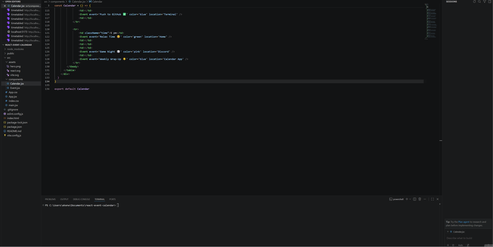

# React Event Calendar

A React and Vite event calendar app for organizing weekly activities, study sessions, game sessions, and community schedules.

## Objective

The goal of this project is to build a reusable weekly event calendar using React. The app displays scheduled activities in a clean timetable format and can be adapted for class schedules, community events, travel itineraries, or Minecraft server planning.

This project was created as part of CodePath WEB102 to practice React fundamentals such as components, JSX, props, styling, and project setup with Vite.

## Demo



## Features

- Weekly calendar layout
- Events displayed in scheduled time blocks
- Reusable React components
- Custom event titles
- Custom event colors
- Event locations using props
- Flexible structure for future schedule types

## Tech Stack

- React
- Vite
- JavaScript
- HTML/CSS

## Getting Started

To run this project locally:

```bash
npm install
npm run dev
```

Then open the local development link shown in the terminal, usually:

```text
http://localhost:5173/
```

## Project Structure

```text
src/
  components/
    Calendar.jsx
    Event.jsx
  App.jsx
  App.css
  index.css
```

## What I Learned

Through this lab, I practiced:

- Creating a React project with Vite
- Building reusable components
- Passing props between components
- Using JSX to structure UI elements
- Styling React components with CSS classes
- Organizing a weekly calendar layout using table rows and columns
- Adding a GIF demo to a GitHub README

## Sources and References

- CodePath WEB102 Lab: Unit 1 - Timetabled
- Vite Documentation: Getting Started with Vite  
  https://vite.dev/guide/
- React Documentation: Your First Component  
  https://react.dev/learn/your-first-component
- React Documentation: Writing Markup with JSX  
  https://react.dev/learn/writing-markup-with-jsx
- React Documentation: JavaScript in JSX  
  https://react.dev/learn/javascript-in-jsx-with-curly-braces
- React Documentation: Passing Props to a Component  
  https://react.dev/learn/passing-props-to-a-component

## Future Improvements

- Add mobile-friendly styling
- Add event categories
- Add Minecraft server event scheduling
- Add admin-editable events
- Add clickable event details
- Add filtering by event type
